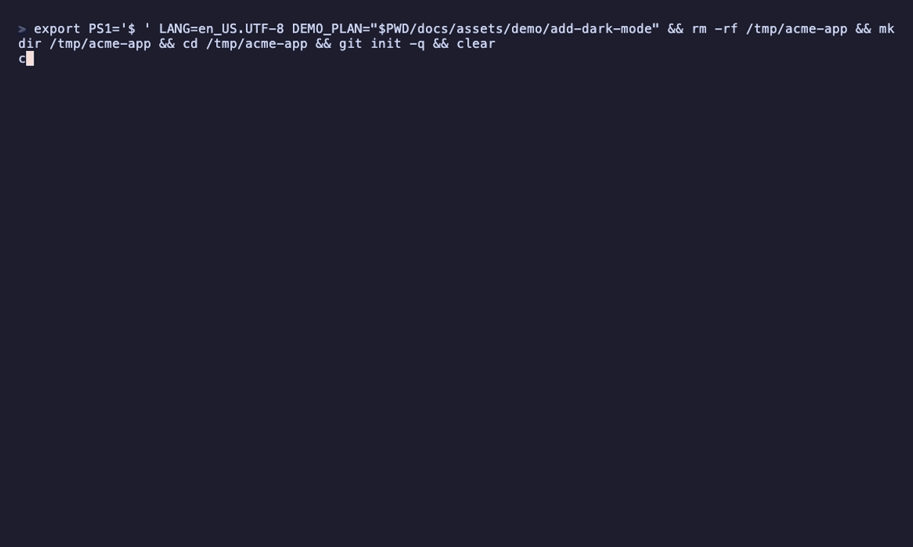

# codev

**Le développement piloté par les specs pour Claude Code.**

[](https://github.com/mairistem/codev/actions/workflows/ci.yml)
[](https://github.com/mairistem/codev/releases/latest)
[](LICENSE)
[](https://github.com/mairistem/codev/releases/latest)

[English](README.md) · Français

codev ajoute une fine couche de spécifications à votre dépôt, pour que vous et
Claude Code vous accordiez sur ce qu'il faut construire avant d'écrire la
moindre ligne de code — et pour que les décisions d'architecture, une fois
prises, cessent d'être remises en débat à chaque change.

<p align="center">
  
</p>

## Pourquoi

Sans specs, l'intention se perd dans l'historique des conversations et dans la
tête des gens. Avec codev, chaque change commence par un petit plan dans
`_codev/changes/` : le pourquoi, le quoi, le comment, et un **delta de spec**
qui énonce le comportement ajouté ou modifié.

Un change ajoute une exigence :

```markdown
## ADDED Requirements

### Requirement: Le thème choisi est mémorisé

L'application SHALL restaurer le dernier thème choisi par l'utilisateur, sur chacun des appareils depuis lesquels il se connecte.

#### Scenario: Utilisateur de retour

- **GIVEN** un utilisateur qui a choisi le thème sombre sur son ordinateur portable
- **WHEN** il se connecte depuis son téléphone
- **THEN** l'application s'affiche avec le thème sombre
```

À l'archivage du change, codev fusionne le delta dans la spec vivante,
`_codev/specs/ui/theme/spec.md`, sans toucher au reste de son contenu :

```markdown
# Theme Specification

## Purpose

Permettre aux utilisateurs de choisir le thème de couleurs de l'interface.

## Requirements

### Requirement: Le thème suit par défaut la préférence du système

L'application SHALL s'afficher avec le jeu de couleurs du système d'exploitation tant que l'utilisateur n'a pas choisi de thème.

#### Scenario: Aucun thème encore choisi
…

### Requirement: Le thème choisi est mémorisé

L'application SHALL restaurer le dernier thème choisi par l'utilisateur, sur chacun des appareils depuis lesquels il se connecte.

#### Scenario: Utilisateur de retour
…
```

La spec décrit toujours ce que fait le système aujourd'hui, et chaque change
archivé garde la trace de ce qui l'a fait évoluer. codev n'appelle jamais
lui-même de modèle : Claude Code rédige, et codev lui indique quoi écrire, où,
et sous quelles contraintes.

## Premiers pas

Installez codev — aucune chaîne d'outils Rust n'est nécessaire.

macOS et Linux :

```bash
curl -sSL https://raw.githubusercontent.com/mairistem/codev/main/install.sh | sh
```

Windows (PowerShell) :

```powershell
iwr -useb https://raw.githubusercontent.com/mairistem/codev/main/install.ps1 | iex
```

Les deux scripts vérifient l'empreinte SHA-256 du binaire qu'ils téléchargent.
Vous pouvez aussi télécharger un binaire depuis la
[page des releases](https://github.com/mairistem/codev/releases/latest), ou
compiler depuis les sources avec `cargo install --path crates/codev-cli` ;
voir le [guide d'installation](https://mairistem.github.io/codev/fr/installation.html).

**Prérequis :** macOS (Apple Silicon ou Intel), Linux x86_64 ou Windows
x86_64, et [Claude Code](https://claude.com/claude-code) pour utiliser les
skills.

### Démarrage rapide

```bash
cd your-project
codev init
```

Puis, dans Claude Code :

```text
/codev-propose add a dark mode that follows the system preference
/codev-apply add-dark-mode
/codev-archive add-dark-mode
```

Le [démarrage rapide](https://mairistem.github.io/codev/fr/quickstart.html)
détaille chaque étape.

## Fonctionnement

Chaque change suit le même cycle, avec une skill Claude Code par étape :

```text
┌───────────┐    ┌───────────┐    ┌───────────┐    ┌───────────┐
│  propose  │───▶│   apply   │───▶│   sync    │───▶│  archive  │
│ planifier │    │ construire│    │ fusionner │    │  classer  │
│           │    │           │    │ les deltas│    │           │
└───────────┘    └───────────┘    └───────────┘    └───────────┘
```

- **propose** — rédige le plan : proposal, deltas de specs, design, tâches.
  Aucun code.
- **apply** — implémente les tâches, lance leur vérification et les coche.
- **sync** — fusionne les deltas dans les specs principales (facultatif :
  l'archivage s'en charge).
- **archive** — valide le change, le fusionne et le déplace dans une archive
  datée.

`/codev-explore`, `/codev-update`, `/codev-onboard` et `/codev-configure`
complètent l'ensemble. Derrière les skills, la CLI `codev` effectue le travail
unitaire — état, instructions, validation, fusion — avec une sortie JSON
stable.

Tout se trouve dans un dossier visible à la racine de votre dépôt :

```text
_codev/
├── specs/        # contrats de comportement — ce que fait le système
├── decisions/    # décisions d'architecture — pourquoi il est construit ainsi
├── changes/      # travail en cours, et l'archive datée
└── config.yaml   # contexte, règles, langue, sources héritées
```

- **Les changes sont des deltas.** Un change déclare des exigences `ADDED`,
  `MODIFIED`, `REMOVED` ou `RENAMED` au lieu de réécrire les specs : codev
  fonctionne ainsi sur du code existant, et pas seulement sur des projets
  neufs.
- **Les décisions sont immuables.** Les ADR acceptés sont scellés par une
  empreinte ; pour en changer un, on le remplace, et `codev validate` détecte
  les modifications silencieuses.
- **Les conventions se partagent.** Un projet peut hériter du contexte, des
  règles et des décisions d'un autre dépôt, en lecture seule et épinglés sur un
  commit git.
- **Votre langue.** Les artefacts sont rédigés dans la langue choisie par votre
  équipe ; leur structure reste lisible par la machine.

## Comparaison

codev fait partie des nombreux outils de développement piloté par les specs
destinés aux agents de code. Voici une synthèse des fonctionnalités
documentées, en septembre 2026 :

| | codev | [OpenSpec](https://github.com/Fission-AI/OpenSpec) | [Spec Kit](https://github.com/github/spec-kit) |
|---|---|---|---|
| Distribution | Binaire natif unique | Paquet npm (Node.js) | CLI Python (installée avec uv) |
| Agents pris en charge | Claude Code | Plus de 30 outils | De nombreux agents, dont GitHub Copilot |
| Deltas de specs fusionnés dans des specs vivantes | Oui | Oui | Non — des artefacts par fonctionnalité |
| Décisions d'architecture (ADR) | Oui, scellées contre les modifications | Non | Non — une constitution de projet à la place |
| Partage entre dépôts | Sources en lecture seule, épinglées par commit git | Stores (bêta) | — |
| Licence | MIT | MIT | MIT |

codev s'appuie directement sur les idées d'OpenSpec : le cycle
propose → apply → archive, le change comme unité de travail, et les opérations
de delta `ADDED` / `MODIFIED` / `REMOVED` / `RENAMED` viennent toutes
d'OpenSpec. Si vous avez besoin d'un autre agent que Claude Code, OpenSpec et
Spec Kit vous conviendront mieux. Si une information de ce tableau n'est plus à
jour, merci d'ouvrir une issue.

## Documentation

La documentation complète se trouve sur
**[mairistem.github.io/codev](https://mairistem.github.io/codev/fr/)** —
workflow, concepts, guides, et références de la CLI, de la configuration et
des formats de fichiers. Elle est aussi embarquée dans le binaire et
consultable hors ligne :

```bash
codev docs --lang fr
```

## Contribuer

Les contributions sont les bienvenues. codev est développé avec codev : les
petites corrections passent par une pull request classique, et tout le reste
commence par un change codev. Consultez [CONTRIBUTING.fr.md](CONTRIBUTING.fr.md),
ainsi que la [feuille de route](ROADMAP.md) (en anglais) pour ce qui est prévu.

Merci de signaler les problèmes de sécurité en privé, comme indiqué dans
[SECURITY.md](SECURITY.md) (en anglais). Ce projet applique un
[code de conduite](CODE_OF_CONDUCT.md) (en anglais).

## Licence

codev est distribué sous [licence MIT](LICENSE).

codev s'inspire d'[OpenSpec](https://github.com/Fission-AI/OpenSpec), de
Fission AI, également distribué sous licence MIT.
